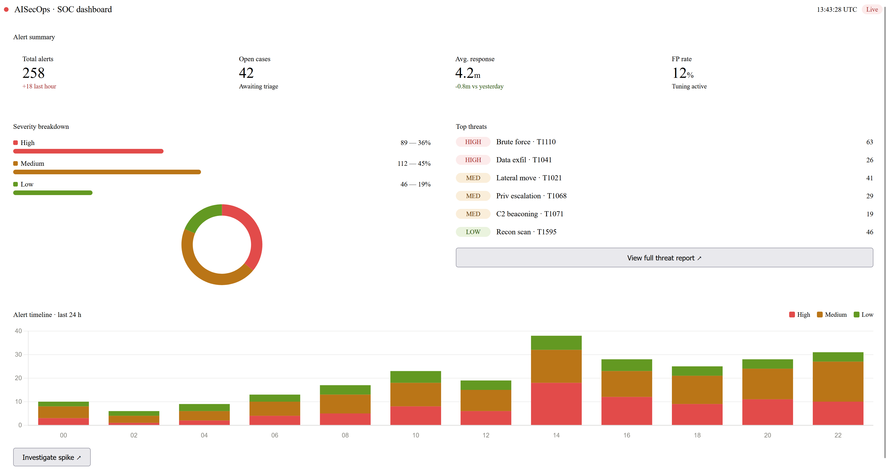

# 🛡️ AI-Autonomous SOC Platform (AISecOps)

> ⚡ Detection Engineering + MITRE ATT&CK + SOAR Simulation  
> A practical implementation of a modern Security Operations Center (SOC) with automated detection and response.

---

## 🚨 Problem Statement

Security teams today struggle with:

- High alert volume (alert fatigue)
- Manual triage delays
- Limited threat context
- Slow response to active threats

This project simulates how a **modern SOC automates detection, enrichment, and response**.

---

## 💡 Solution Overview

This platform demonstrates an **AI-assisted SOC pipeline** that:

- Ingests and processes log data  
- Detects threats using rule-based + anomaly detection  
- Maps alerts to **MITRE ATT&CK techniques**  
- Simulates automated response actions (SOAR)  
- Visualizes alerts via a dashboard  

---

## 🧱 Architecture



> **Flow:** Logs → Detection → MITRE Mapping → Response → Alerts  

### 🔍 Components

- **Log Ingestion**
  - Simulated logs (JSON-based)
- **Detection Engine**
  - Rule-based detection  
  - Isolation Forest (anomaly detection)
- **MITRE Mapping**
  - Maps alerts to techniques (e.g., T1110, T1041)
- **Response Engine**
  - Simulated SOAR actions:
    - quarantine_host  
    - block_ip  
    - disable_user  
- **Alerting Layer**
  - Structured alert output for SOC workflows  

---

## ⚙️ Detection Pipeline



> **Pipeline:** Ingest → Normalize → Detect → Enrich → Respond → Visualize  

### 🔍 Pipeline Stages

- **Ingest** → Load logs from data source  
- **Normalize** → Standardize fields  
- **Detect** → Identify anomalies and known patterns  
- **Enrich** → Add MITRE + threat context  
- **Respond** → Trigger automated actions  
- **Visualize** → Dashboard representation  

---

## ⚔️ Attack Simulation



Simulated attack scenarios include:

- Brute Force Attack (**T1110**)  
- Lateral Movement (**T1021**)  
- Data Exfiltration (**T1041**)  
- Command & Control (**T1071**)  

---

## 📊 SOC Dashboard

🚀 *(Optional Live Demo — if deployed)*  



### Features

- Alert severity breakdown  
- Timeline visualization  
- MITRE technique visibility  
- Real-time SOC-style metrics  

---

## 🧪 Sample Output

```json
{
  "alert": "Suspicious Login Spike",
  "severity": "high",
  "mitre": "T1110",
  "response": "quarantine_host"
}
